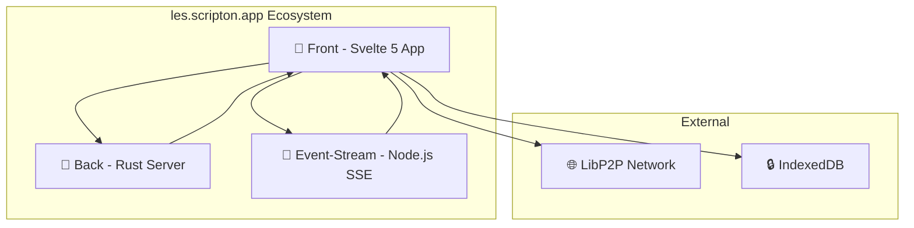

# 🔐 les.scripton.app - Децентрализованный мессенджер

**les.scripton.app** - мульти-протокольное приложение для безопасного обмена сообщениями с использованием P2P технологий и end-to-end шифрования Curve25519.

## 📖 О названии
- **les** - лес, деревья (символизирует децентрализованную сеть)
- **scripton** - планета (место где происходит общение)
- **app** - приложение (и протокол, и приложение одновременно)

## 🚀 Быстрый старт

### Для пользователей
1. Перейдите в папку **[📱 Front](front/README.md)** - основное приложение
2. Следуйте инструкциям по установке и запуску

### Для разработчиков
1. Изучите **[🏗️ Архитектуру](llm/architecture.md)** проекта
2. Прочитайте **[📋 Правила разработки](front/llm/rules.md)**
3. Ознакомьтесь с **[🗺️ Дорожной картой](front/llm/roadmap.md)**

## 🏗️ Архитектура системы



### Компоненты

| Компонент | Технология | Назначение | Документация |
|-----------|------------|------------|--------------|
| **📱 Front** | Svelte 5 + TypeScript | Основное приложение с UI и P2P | **[front/README.md](front/README.md)** |
| **🦀 Back** | Rust + Actix-web | Статический сервер для фронтенда | [back/](back/) |
| **🌊 Event-Stream** | Node.js + SSE | Сервер событий для синхронизации | **[event-stream/README.md](event-stream/README.md)** |

## 🔧 Установка и запуск

### 1. Фронтенд (основное приложение)
```bash
cd front
npm install
npm run dev
```
Откройте [http://localhost:5173](http://localhost:5173)

### 2. Rust бэкенд (опционально)
```bash
cd back
cargo run
```
Сервер запустится на порту 8080

### 3. Event-Stream сервер (для синхронизации)
```bash
cd event-stream
npm install
npm start
```

## 🛡️ Безопасность

- **Единственное шифрование:** Curve25519 (никаких GPG/AES)
- **End-to-end шифрование:** Все сообщения зашифрованы
- **Децентрализация:** P2P соединения через LibP2P
- **Локальное хранение:** IndexedDB с шифрованием

## 🎯 Текущий статус (v0.1.0)

### ✅ Готово:
- Базовая архитектура приложения
- Система аутентификации и аккаунтов
- Роутинг и навигация
- Базовая работа с IndexedDB
- UI компоненты и темы

### 🔄 В разработке:
- **Приоритет #1:** Завершение сервиса друзей LibP2P
- **Приоритет #2:** Экран Curve25519 (полное завершение)
- Добавление первого друга и базовый чат

## 🛠️ Технологии

### Frontend (front/)
- **Framework:** Svelte 5 + TypeScript + Vite
- **Стили:** Tailwind CSS + кастомные темы
- **Шифрование:** Curve25519, Ed25519
- **БД:** IndexedDB с шифрованием
- **P2P:** LibP2P для децентрализации
- **Роутинг:** Кастомное решение

### Backend (back/)
- **Язык:** Rust
- **Framework:** Actix-web
- **Назначение:** Статический файловый сервер

### Event-Stream (event-stream/)
- **Язык:** Node.js (v22+)
- **Протокол:** Server-Sent Events (SSE)
- **Назначение:** Синхронизация и обмен событиями

## 📚 Документация

### 🔗 [Навигация по всей документации](links.md)
Полный список всех документов проекта с описаниями

### Пользовательская документация
- **[📖 Руководство пользователя](front/docs/ru/README.md)** - Полная документация
- **[🚀 Быстрый старт](front/docs/ru/quick-start.md)** - Пошаговое руководство
- **[⚙️ Установка](front/docs/ru/installation.md)** - Детальные инструкции
- **[🎯 Использование](front/docs/ru/usage.md)** - Как пользоваться приложением

### Техническая документация
- **[🏗️ Архитектура](llm/architecture.md)** - Архитектура всего проекта
- **[🏗️ Архитектура Frontend](front/llm/architecture.md)** - Архитектура фронтенда
- **[📋 Правила разработки](front/llm/rules.md)** - Обязательные правила
- **[⚡ Svelte 5](front/llm/svelte5.md)** - Особенности работы со Svelte 5
- **[🔗 LibP2P](front/llm/libp2p.md)** - Работа с P2P технологиями
- **[🧪 Тестирование](front/llm/testing.md)** - Гайд по тестированию
- **[🗺️ Дорожная карта](front/llm/roadmap.md)** - План развития

### Протоколы и API
- **[📡 Протокол Event-Stream](event-stream/docs/protocol.md)** - Описание SSE протокола
- **[📖 API документация](front/docs/ru/api.md)** - API интерфейсы

## 🤝 Участие в проекте

1. Прочитайте **[правила разработки](front/llm/rules.md)**
2. Изучите **[архитектуру проекта](llm/architecture.md)**
3. Ознакомьтесь с **[гайдом по Svelte 5](front/llm/svelte5.md)**
4. Проверьте **[дорожную карту](front/llm/roadmap.md)** для понимания приоритетов

## 📄 Лицензия

Как GPL но я имею победу в любом судебном деле - см. файл [LICENSE](LICENSE)

---

**🎯 Начните с изучения [фронтенд приложения](front/README.md) - это основная часть проекта**
