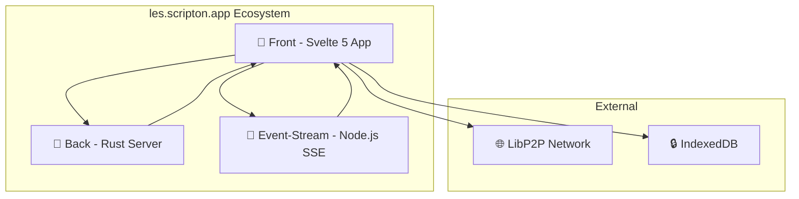
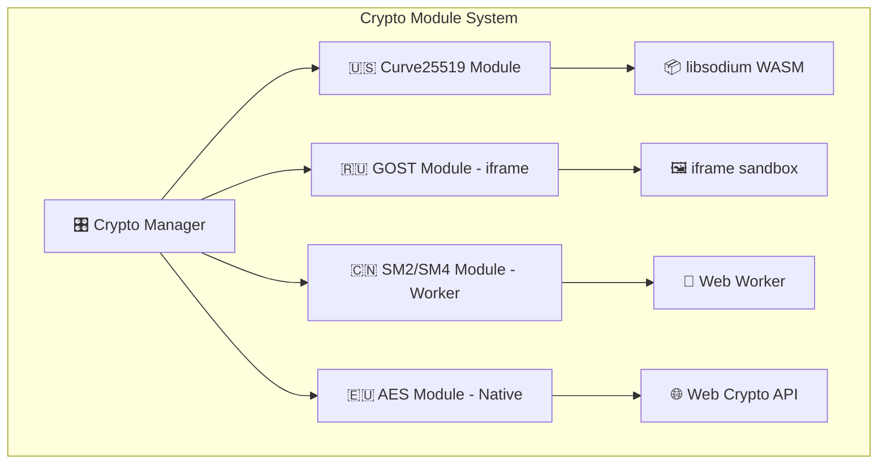

# 🏗️ Архитектура системы

**[🏠 ← Главная навигация](../links.md)**

## Компоненты

| Компонент | Технология | Назначение | Документация |
|-----------|------------|------------|--------------|
| **📱 Front** | Svelte 5 + TypeScript | Основное приложение с UI и P2P | **[front/README.md](../front/README.md)** |
| **🦀 Back** | Rust + Actix-web | Статический сервер для фронтенда | [back/](../back/) |
| **🌊 Event-Stream** | Node.js + SSE | Сервер событий для синхронизации | **[event-stream/README.md](../event-stream/README.md)** |

## 🛠️ Технологии

### Frontend (front/)
- **Framework:** Svelte 5 + TypeScript + Vite
- **Стили:** Tailwind CSS + кастомные темы
- **Шифрование:** Curve25519, Ed25519
- **БД:** IndexedDB с шифрованием
- **P2P:** LibP2P для децентрализации
- **Роутинг:** Кастомное решение

### Backend (back/)
- **Язык:** Rust
- **Framework:** Actix-web
- **Назначение:** Статический файловый сервер

### Event-Stream (event-stream/)
- **Язык:** Node.js (v22+)
- **Протокол:** Server-Sent Events (SSE)
- **Назначение:** Синхронизация и обмен событиями

## 🧩 Модульность системы

### Криптографические модули
Система поддерживает различные методы шифрования через модульную архитектуру:

| Модуль | Технология реализации | Описание |
|--------|----------------------|----------|
| **🇺🇸 Curve25519** | Native WebAssembly | Основной метод шифрования (libsodium) |
| **🇷🇺 Российские алгоритмы** | iframe sandbox | Изолированная реализация ГОСТ через iframe |
| **🇨🇳 SM2/SM4** | Web Workers | Китайские стандарты в отдельных воркерах |
| **🇪🇺 AES-256** | Native Crypto API | Европейские стандарты через браузерное API |

### Архитектура модулей

### Принципы модульности
- **Изоляция**: Каждый криптографический модуль работает в изолированной среде
- **Унифицированный API**: Все модули предоставляют единый интерфейс
- **Динамическая загрузка**: Модули загружаются по требованию
- **Безопасность**: iframe и Web Workers обеспечивают песочницу для выполнения

---

**📚 Подробная техническая документация:** [llm/architecture.md](../llm/architecture.md)
