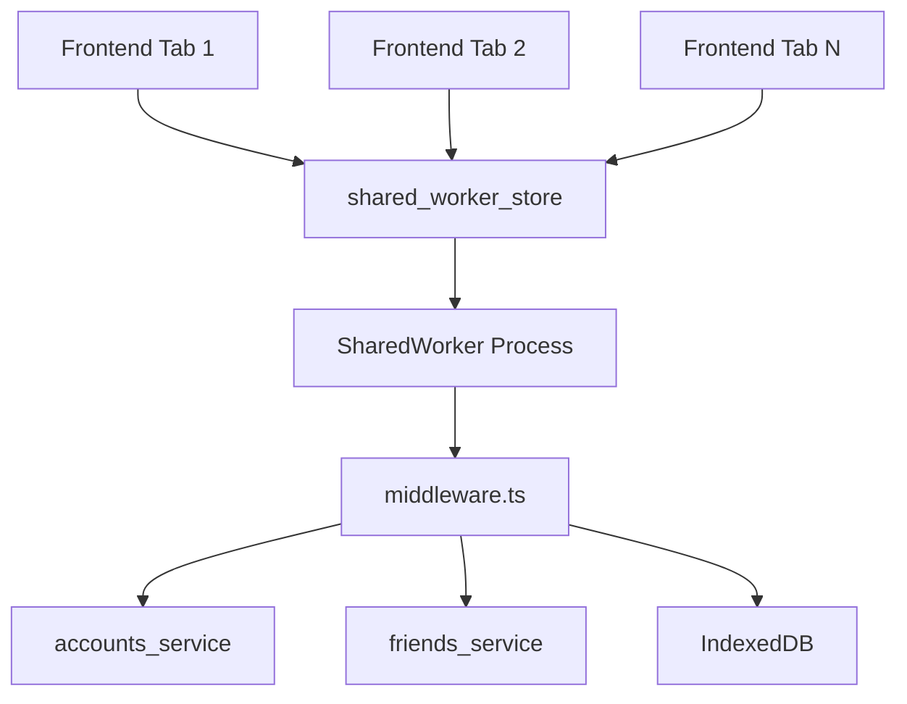

# 🔄 SharedWorker API Documentation

Полная документация по API SharedWorker в системе Secure Message. SharedWorker обеспечивает межвкладочное взаимодействие и централизованное управление состоянием.

## 📋 Обзор архитектуры



### Компоненты

- **`shared_worker_store`** - основной API для взаимодействия с SharedWorker
- **`middleware.ts`** - маршрутизатор запросов в SharedWorker
- **Services** - бизнес-логика (accounts_service, friends_service)
- **PATHS** - константы путей для операций

---

## 🔌 API Methods

### 1. fetch() - Запрос-ответ

Отправляет единичный запрос и ожидает ответ.

```typescript
import { shared_worker_store } from '@/processes/shared_worker/shared_worker_store';
import { PATHS } from '@/local_back/constant/PATHS';

// Базовый синтаксис
const result = await shared_worker_store.fetch({
  path: PATHS.OPERATION_NAME,
  body?: { /* параметры */ }
});
```

#### Примеры использования

```typescript
// Логин
await shared_worker_store.fetch({
  path: PATHS.LOGIN,
  body: { pass: "user_password" }
});

// Получение аккаунтов
const accounts = await shared_worker_store.fetch({
  path: PATHS.GET_ACCOUNTS
});

// Добавление друга
await shared_worker_store.fetch({
  path: PATHS.ADD_FRIENDS,
  body: {
    list: [friendEntity],
    myAccId: "account_id"
  }
});

// Обновление аккаунтов
await shared_worker_store.fetch({
  path: PATHS.PUT_ACCOUNTS,
  body: {
    list: [updatedAccount]
  }
});
```

### 2. subscribeToWorker() - Подписка на обновления

Создает подписку на реактивные данные с множественными обновлениями.

```typescript
// Базовый синтаксис
const unsubscribe = shared_worker_store.subscribeToWorker({
  payload: {
    path: PATHS.OPERATION_NAME,
    body?: { /* параметры */ }
  },
  callback: (data) => {
    // Обработка обновлений
  }
});

// Отписка
unsubscribe();
```

#### Примеры использования

```typescript
// Подписка на количество активных вкладок
const unsubscribe = shared_worker_store.subscribeToWorker({
  payload: {
    path: PATHS.GET_ACTIVE_TABS_COUNT
  },
  callback: (data) => {
    console.log('Активных вкладок:', data.count);
    updateTabsCounter(data.count);
  }
});

// Не забудьте отписаться при размонтировании компонента
onDestroy(() => {
  unsubscribe();
});
```

---

## 📊 Доступные операции (PATHS)

### Аккаунты

| Path | Method | Описание | Body | Return |
|------|--------|----------|------|--------|
| `LOGIN` | fetch | Авторизация | `{ pass: string }` | `void` |
| `GET_ACCOUNTS` | fetch | Список аккаунтов | - | `Account[]` |
| `ADD_ACCOUNTS` | fetch | Добавить аккаунты | `{ list: AccountEntity[] }` | `void` |
| `PUT_ACCOUNTS` | fetch | Обновить аккаунты | `{ list: AccountEntityPut[] }` | `void` |
| `DELETE_ACCOUNTS` | fetch | Удалить аккаунты | `{ ids: string[] }` | `void` |
| `GET_PEER_ID_BY_ACC_ID_FOR_LIBP2P` | fetch | Получить PeerID | `{ accId: string }` | `string` |

### Друзья

| Path | Method | Описание | Body | Return |
|------|--------|----------|------|--------|
| `GET_FRIENDS` | fetch | Список всех друзей | - | `FriendEntityFull[]` |
| `GET_FRIENDS_BY_ACCOUNT_ID` | fetch | Друзья по аккаунту | `{ myAccId: string }` | `FriendEntityFull[]` |
| `GET_FRIEND_BY_ID` | fetch | Друг по ID | `{ friendId: string }` | `FriendEntityFull \| null` |
| `ADD_FRIENDS` | fetch | Добавить друзей | `{ list: FriendEntity[], myAccId?: string }` | `void` |
| `PUT_FRIENDS` | fetch | Обновить друзей | `{ list: FriendEntityPut[] }` | `void` |
| `DELETE_FRIENDS` | fetch | Удалить друзей | `{ ids: string[] }` | `void` |

### Вкладки

| Path | Method | Описание | Body | Return |
|------|--------|----------|------|--------|
| `GET_ACTIVE_TABS_COUNT` | fetch/subscribe | Количество активных вкладок | - | `{ count: number }` |

---

## 📝 Типы данных

### Основные типы

```typescript
// Параметры запроса
type FetchParams = BackMiddlewarePayload;

// Параметры подписки
type SubscribeParams = {
  payload: BackMiddlewarePayload;
  callback: (data: any) => void;
};

// Событие middleware
type BackMiddlewareProps = {
  type: "FETCH";
  payload: BackMiddlewarePayload;
  idRequest: string | number;
};
```

### Payload типы

```typescript
// Логин
type LoginPayload = {
  path: "LOGIN";
  body: { pass: string };
};

// Добавление аккаунтов
type AddAccountsPayload = {
  path: "ADD_ACCOUNTS";
  body: { list: AccountEntity[] };
};

// Добавление друзей
type AddFriendsPayload = {
  path: "ADD_FRIENDS";
  body: {
    list: FriendEntity[];
    myAccId?: string;
  };
};

// Получение активных вкладок
type GetActiveTabsCountPayload = {
  path: "GET_ACTIVE_TABS_COUNT";
};
```

---

## 🎯 Практические примеры

### Создание API обертки

```typescript
// front/src/api/shared_worker/accounts.ts
import { shared_worker_store } from "../../processes/shared_worker/shared_worker_store";
import { PATHS } from "../../local_back/constant/PATHS";

export const accounts = {
  async login(pass: string): Promise<void> {
    await shared_worker_store.fetch({
      path: PATHS.LOGIN,
      body: { pass }
    });
  },

  async getList(): Promise<Account[]> {
    const result = await shared_worker_store.fetch({
      path: PATHS.GET_ACCOUNTS
    });
    return result as Account[];
  },

  async update(accountList: AccountEntityPut[]): Promise<void> {
    await shared_worker_store.fetch({
      path: PATHS.PUT_ACCOUNTS,
      body: { list: accountList }
    });
  }
};
```

### Реактивный счетчик вкладок

```typescript
// front/src/api/shared_worker/tabs.ts
import { shared_worker_store } from "../../processes/shared_worker/shared_worker_store";
import { PATHS } from "../../local_back/constant/PATHS";

export const tabs = {
  createReactiveTabsCounter() {
    let currentCount = 0;
    let isConnected = false;
    let unsubscribe: (() => void) | null = null;
    let onCountCallbacks: ((count: number) => void)[] = [];
    let onConnectionCallbacks: ((connected: boolean) => void)[] = [];

    const setupSubscription = (callback?: (count: number) => void) => {
      if (unsubscribe) {
        unsubscribe();
      }
      
      unsubscribe = shared_worker_store.subscribeToWorker({
        payload: { path: PATHS.GET_ACTIVE_TABS_COUNT },
        callback: (data) => {
          currentCount = data.count;
          isConnected = true;
          
          // Уведомляем всех подписчиков
          onCountCallbacks.forEach(cb => cb(currentCount));
          onConnectionCallbacks.forEach(cb => cb(true));
          
          if (callback) callback(currentCount);
        }
      });
    };

    return {
      subscribe: (callback: (count: number) => void) => {
        onCountCallbacks.push(callback);
        setupSubscription();
        
        return () => {
          const index = onCountCallbacks.indexOf(callback);
          if (index > -1) {
            onCountCallbacks.splice(index, 1);
          }
          
          if (onCountCallbacks.length === 0 && unsubscribe) {
            unsubscribe();
            unsubscribe = null;
          }
        };
      },

      getCurrentCount: async (): Promise<number> => {
        if (isConnected) {
          return currentCount;
        }
        
        // Получаем актуальное значение через временную подписку
        return new Promise((resolve, reject) => {
          const timeout = setTimeout(() => {
            reject(new Error('Timeout: не удалось получить количество вкладок'));
          }, 3000);
          
          const tempUnsub = shared_worker_store.subscribeToWorker({
            payload: { path: PATHS.GET_ACTIVE_TABS_COUNT },
            callback: (data) => {
              clearTimeout(timeout);
              tempUnsub();
              resolve(data.count);
            }
          });
        });
      },

      isConnected: () => isConnected,
      
      onConnectionChange: (callback: (connected: boolean) => void) => {
        onConnectionCallbacks.push(callback);
        
        return () => {
          const index = onConnectionCallbacks.indexOf(callback);
          if (index > -1) {
            onConnectionCallbacks.splice(index, 1);
          }
        };
      }
    };
  }
};
```

### Использование в Svelte компоненте

```typescript
// SomeComponent.svelte
<script lang="ts">
  import { onMount, onDestroy } from 'svelte';
  import { shared_worker_store } from '@/processes/shared_worker/shared_worker_store';
  import { PATHS } from '@/local_back/constant/PATHS';

  let activeTabsCount = $state(0);
  let unsubscribe: (() => void) | null = null;

  onMount(() => {
    // Подписка на обновления
    unsubscribe = shared_worker_store.subscribeToWorker({
      payload: { path: PATHS.GET_ACTIVE_TABS_COUNT },
      callback: (data) => {
        activeTabsCount = data.count;
      }
    });
  });

  onDestroy(() => {
    if (unsubscribe) {
      unsubscribe();
    }
  });

  async function handleLogin() {
    try {
      await shared_worker_store.fetch({
        path: PATHS.LOGIN,
        body: { pass: password }
      });
      console.log('Успешный логин');
    } catch (error) {
      console.error('Ошибка логина:', error);
    }
  }
</script>

<div>
  <p>Активных вкладок: {activeTabsCount}</p>
  <button onclick={handleLogin}>Войти</button>
</div>
```

---

## ⚡ Особенности и ограничения

### Timeout
- Все `fetch` запросы имеют timeout 5 минут (300000ms)
- При превышении timeout возвращается ошибка

### Очередь запросов
- Если SharedWorker не инициализирован, запросы добавляются в очередь
- После инициализации очередь обрабатывается автоматически

### ID запросов
- Каждый запрос получает уникальный `idRequest`
- Используется для сопоставления ответов с запросами

### Подписки
- Подписки автоматически очищаются при отписке
- Важно всегда вызывать `unsubscribe()` во избежание утечек памяти

---

## 🔧 Отладка

### Логирование

```typescript
// Включить подробные логи (только в dev режиме)
import { devLog } from '@/core/debug/logger';

// Все операции shared_worker_store логируются автоматически:
// - "shared_worker_store.fetch ВЫЗОВ с параметрами"
// - "shared_worker_store.subscribeToWorker ВЫЗОВ с параметрами" 
// - "shared_worker_store.performFetch успешный ответ"
```

### Типичные проблемы

1. **SharedWorker не инициализирован**
   ```typescript
   // Проблема: запрос до инициализации
   // Решение: запросы автоматически добавляются в очередь
   ```

2. **Утечки памяти в подписках**
   ```typescript
   // Проблема: забыли отписаться
   let unsubscribe = subscribeToWorker(...);
   
   // Решение: всегда отписывайтесь
   onDestroy(() => {
     if (unsubscribe) unsubscribe();
   });
   ```

3. **Timeout запросов**
   ```typescript
   // Проблема: долгие операции
   // Решение: проверьте middleware и сервисы
   ```

---

## 🎯 Лучшие практики

### 1. Создание API оберток
```typescript
// ✅ Хорошо: создавайте типизированные обертки
export const friendsAPI = {
  async add(friend: FriendEntity, myAccId?: string) {
    return shared_worker_store.fetch({
      path: PATHS.ADD_FRIENDS,
      body: { list: [friend], myAccId }
    });
  }
};

// ❌ Плохо: прямое использование в компонентах
shared_worker_store.fetch({ path: PATHS.ADD_FRIENDS, body: { list: [friend] } });
```

### 2. Управление подписками
```typescript
// ✅ Хорошо: автоматическая отписка
onMount(() => {
  const unsubscribe = subscribeToWorker(...);
  return unsubscribe; // Svelte автоматически вызовет при размонтировании
});

// ✅ Хорошо: проверка состояния
onDestroy(() => {
  if (unsubscribe) {
    unsubscribe();
    unsubscribe = null;
  }
});
```

### 3. Обработка ошибок
```typescript
// ✅ Хорошо: всегда обрабатывайте ошибки
try {
  const result = await shared_worker_store.fetch({
    path: PATHS.GET_ACCOUNTS
  });
  return result;
} catch (error) {
  console.error('Ошибка получения аккаунтов:', error);
  throw error; // или верните fallback значение
}
```

### 4. Типизация
```typescript
// ✅ Хорошо: используйте типы
async function getAccounts(): Promise<Account[]> {
  const result = await shared_worker_store.fetch({
    path: PATHS.GET_ACCOUNTS
  });
  return result as Account[];
}

// ✅ Еще лучше: создайте типизированные функции
const typedFetch = <T extends keyof ResultByPath>(
  path: T,
  body?: any
): Promise<ResultByPath[T]> => {
  return shared_worker_store.fetch({ path, body });
};
```

---

## 📚 Связанные документы

- [Backend Middleware](../front/src/local_back/middleware.ts)
- [Services Documentation](./services-api.md)
- [PATHS Constants](../front/src/local_back/constant/PATHS.ts)
- [Main API Reference](./api-reference.md)

---

*Последнее обновление: январь 2025*

*Документация актуальна для версии SharedWorker API v1.0*