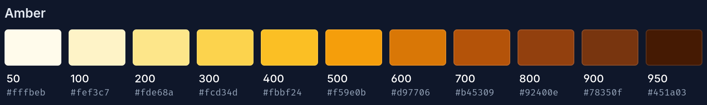
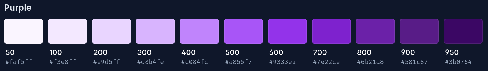
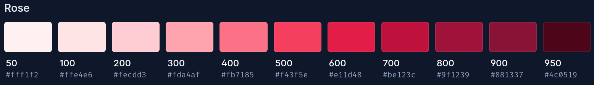
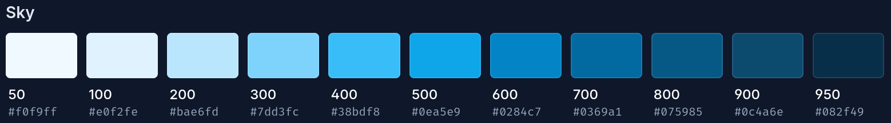
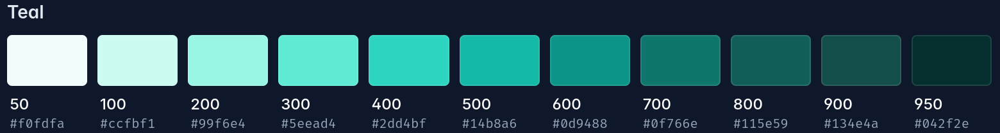
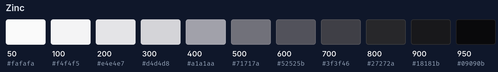

# 🧭 Навигация по документации проекта

Это центральный файл навигации по всей документации проекта Secure Message.

## 📚 Основная документация

### 🏠 Главная документация
- **[README.md](../README.md)** - Главная страница проекта, обзор и быстрые ссылки
- **[📖 Руководство пользователя (RU)](ru/README.md)** - Полная документация на русском языке
- **[🚀 Быстрый старт (RU)](ru/quick-start.md)** - Пошаговое руководство по запуску

### 🌐 Русская документация
- **[Установка](ru/installation.md)** - Инструкции по установке и настройке
- **[Использование](ru/usage.md)** - Руководство по использованию приложения
- **[API документация](ru/api.md)** - Описание API интерфейсов
- **[Темы](ru/themes.md)** - Настройка тем оформления
- **[FAQ](ru/faq.md)** - Часто задаваемые вопросы
- **[Устранение неполадок](ru/troubleshooting.md)** - Решение проблем
- **[Главное меню](ru/main-menu.md)** - Навигация по интерфейсу

### 🇬🇧 English documentation
- **[Main menu](en/main-menu.md)** - Interface navigation guide

## 🛠️ Техническая документация

### 🔧 Backend API
- **[src/local_back/README.md](../src/local_back/README.md)** - API методы local_back сервера, эндпоинты и архитектура

### 🔐 Криптография
- **[src/core/crypt/README.md](../src/core/crypt/README.md)** - Документация по криптографическим модулям и алгоритмам

### 🔄 Разработка
- **[Уведомления](ru/develop/notifications.md)** - Система уведомлений
- **[API уведомлений](ru/develop/notifications/api.md)** - API для работы с уведомлениями

## 🎨 Дизайн и стили

### 🌈 Стилизация
- **[Стили](styles/styles.md)** - Руководство по стилям и компонентам
- **[Темы оформления](themes.md)** - Настройка и создание тем

### 🖼️ Иконки тем
- **Amber** - 
- **Purple** - 
- **Rose** - 
- **Sky** - 
- **Teal** - 
- **Zinc** - 

## ⚙️ Разработка и инструменты

### 🛠️ Инструменты разработки
- **[VSCode Pro Tips](vscode-pro-tips.md)** - Советы по работе с VSCode
- **[Cline VSCode Extension](cline-vscode-extension.md)** - Использование расширения Cline
- **[Svelte + Vite](svelte-vite.md)** - Настройка и работа со Svelte и Vite
- **[Data Attributes](data-attribute.md)** - Работа с data атрибутами

## 🐛 Правила и ошибки

### ⚠️ Нарушение архитектурных правил
**Файл с нарушением:** `src/local_back/modules/createFriendsLibp2pService.ts`

**Правило:** Модули должны использовать `back_store` для получения данных аккаунтов, а не напрямую обращаться к IndexedDB через `get_account_by_id`.

**Исправление:** ✅ Заменено использование `get_account_by_id()` на `back_store.accounts_by_id[id]` для соблюдения архитектурных принципов и повышения производительности.

---

> 💡 **Совет:** Всегда начинайте изучение проекта с [главного README](../README.md), затем переходите к [руководству пользователя](ru/README.md) для детального понимания.
