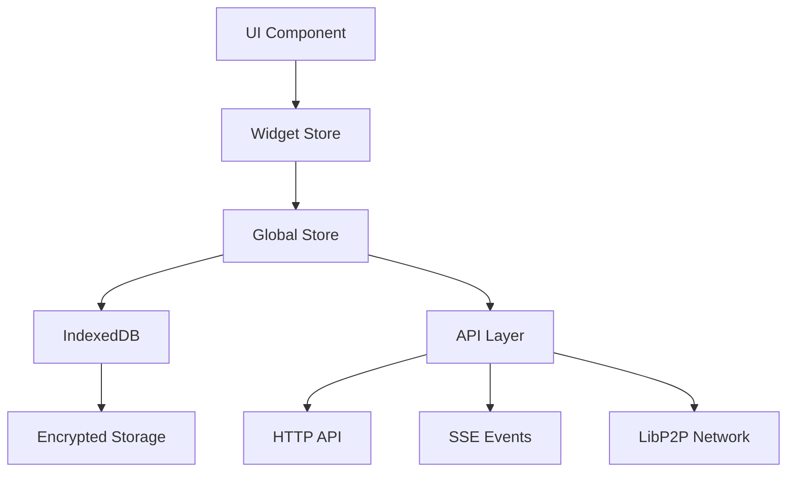

# 🏗️ Архитектура Frontend

## 📁 Структура проекта Frontend

```
front/src/
├── pages/           # 📄 Страницы приложения
│   ├── ui/         # Svelte компоненты страниц
│   ├── stores/     # Сторы для страниц
│   └── index.ts    # Экспорт страниц
├── widgets/         # 🧩 Бизнес-компоненты
│   ├── WidgetName/
│   │   ├── ui/     # UI компоненты виджета
│   │   ├── stores/ # Локальные сторы виджета
│   │   └── index.ts # Экспорт виджета
├── components/      # ⚠️ DEPRECATED - переносить в widgets/
├── stores/          # 🗄️ Глобальные сторы
├── core/            # 🔧 Утилиты и хелперы
│   ├── crypt/      # Криптографические функции
│   ├── validation/ # Валидация данных
│   ├── fs/         # Файловая система
│   └── ...         # Другие утилиты
├── api/             # 🌐 Внешние API
│   ├── http/       # HTTP запросы
│   ├── sse/        # Server-Sent Events
│   └── libp2p/     # P2P соединения
├── indexdb/         # 💾 База данных
│   ├── accounts/   # Аккаунты пользователей
│   ├── friends/    # Список друзей
│   ├── rooms/      # Комнаты чатов
│   └── ...         # Другие таблицы
├── routing/         # 🗺️ Кастомный роутинг
│   ├── ui/         # UI компоненты роутинга
│   └── stores/     # Сторы роутинга
├── types/           # 📝 TypeScript типы
├── styles/          # 🎨 Глобальные стили
└── libs/            # 📚 Внешние библиотеки
```

## 🏗️ Архитектурные принципы

### 1. Feature-Sliced Design (FSD)
```
📄 Pages    - Страницы приложения (роуты)
🧩 Widgets  - Бизнес-компоненты с логикой
🔧 Core     - Переиспользуемые утилиты
🌐 API      - Внешние интеграции
💾 IndexDB  - Локальное хранилище
```

### 2. Правила именования
- **Виджеты**: `PascalCase` (например, `UserProfile`)
- **Страницы**: `PascalCase` (например, `HomePage`)
- **Файлы**: `kebab-case` (например, `user-profile.svelte`)
- **Сторы**: `camelCase` (например, `userStore`)

### 3. Структура виджетов
```typescript
// widgets/UserProfile/index.ts
export { default as UserProfile } from './ui/UserProfile.svelte'
export { userProfileStore } from './stores/user-profile.store'
export type { UserProfileProps } from './types'
```

## 🔄 Потоки данных

### Архитектура стора


### Пример потока данных
```typescript
// 1. UI компонент вызывает действие
const handleSendMessage = () => {
  chatStore.sendMessage(messageText)
}

// 2. Стор обрабатывает действие
const sendMessage = async (text: string) => {
  // Сохранить в IndexedDB
  await messagesDB.add(message)
  
  // Отправить через P2P
  await libp2pAPI.sendMessage(message)
  
  // Обновить UI
  messages.update(msgs => [...msgs, message])
}
```

## 🧩 Компонентная архитектура

### Иерархия компонентов
```
App.svelte
├── Router
│   ├── Pages/
│   │   ├── HomePage
│   │   ├── ChatPage
│   │   └── SettingsPage
│   └── Widgets/
│       ├── Navigation
│       ├── UserProfile
│       ├── ChatWidget
│       └── FriendsList
```

### Пример виджета
```svelte
<!-- widgets/ChatWidget/ui/ChatWidget.svelte -->
<script lang="ts">
  import { chatStore } from '../stores/chat.store'
  import { MessageList, MessageInput } from './components'
  
  export let roomId: string
  
  $: chatStore.setActiveRoom(roomId)
</script>

<div data-widget-name="ChatWidget" class="chat-widget">
  <MessageList messages={$chatStore.messages} />
  <MessageInput onSend={chatStore.sendMessage} />
</div>
```

## 🔐 Криптографическая архитектура

### Уровни шифрования
```typescript
// 1. Транспортный уровень (TLS)
const httpClient = new HTTPClient({ 
  baseURL: 'https://api.example.com' 
})

// 2. Прикладной уровень (Curve25519)
const encryptedMessage = await curve25519.encrypt(
  message, 
  recipientPublicKey
)

// 3. Уровень хранения (IndexedDB)
const encryptedData = await localCrypto.encrypt(
  data, 
  userPassword
)
```

### Управление ключами
```typescript
// core/crypt/key-manager.ts
export class KeyManager {
  async generateKeyPair(): Promise<KeyPair> {
    return await curve25519.generateKeyPair()
  }
  
  async deriveKey(password: string): Promise<CryptoKey> {
    return await pbkdf2.derive(password, salt, iterations)
  }
  
  async storeKey(key: CryptoKey): Promise<void> {
    await indexedDB.keys.add(await this.encryptKey(key))
  }
}
```

## 🌐 API архитектура

### HTTP API
```typescript
// api/http/user-api.ts
export class UserAPI {
  async getProfile(userId: string): Promise<UserProfile> {
    return await this.client.get(`/users/${userId}`)
  }
  
  async updateProfile(data: UpdateProfileData): Promise<void> {
    await this.client.put('/users/profile', data)
  }
}
```

### Server-Sent Events
```typescript
// api/sse/event-stream.ts
export class EventStream {
  private eventSource: EventSource
  
  connect(url: string): void {
    this.eventSource = new EventSource(url)
    this.eventSource.onmessage = this.handleMessage
  }
  
  private handleMessage = (event: MessageEvent) => {
    const data = JSON.parse(event.data)
    eventBus.emit(data.type, data.payload)
  }
}
```

### LibP2P Integration
```typescript
// api/libp2p/p2p-client.ts
export class P2PClient {
  private node: Libp2p
  
  async connect(peerId: string): Promise<void> {
    await this.node.dial(peerId)
  }
  
  async sendMessage(peerId: string, message: string): Promise<void> {
    const encrypted = await this.encrypt(message, peerId)
    await this.node.services.pubsub.publish(topic, encrypted)
  }
}
```

## 💾 IndexedDB архитектура

### Схема базы данных
```typescript
// indexdb/schema.ts
export const dbSchema = {
  accounts: {
    keyPath: 'id',
    indexes: ['email', 'publicKey']
  },
  friends: {
    keyPath: 'id',
    indexes: ['peerId', 'status']
  },
  messages: {
    keyPath: 'id',
    indexes: ['roomId', 'timestamp', 'senderId']
  },
  rooms: {
    keyPath: 'id',
    indexes: ['type', 'lastActivity']
  }
}
```

### Работа с данными
```typescript
// indexdb/messages/messages-db.ts
export class MessagesDB {
  async add(message: Message): Promise<void> {
    const encrypted = await this.encrypt(message)
    await this.db.messages.add(encrypted)
  }
  
  async getByRoom(roomId: string): Promise<Message[]> {
    const encrypted = await this.db.messages
      .where('roomId')
      .equals(roomId)
      .toArray()
    
    return await Promise.all(
      encrypted.map(msg => this.decrypt(msg))
    )
  }
}
```

## 🗺️ Роутинг

### Кастомный роутер
```typescript
// routing/router.ts
export class Router {
  private routes = new Map<string, RouteConfig>()
  
  register(path: string, component: ComponentType): void {
    this.routes.set(path, { component, path })
  }
  
  navigate(path: string): void {
    history.pushState(null, '', path)
    this.render(path)
  }
  
  private render(path: string): void {
    const route = this.routes.get(path)
    if (route) {
      currentRoute.set(route)
    }
  }
}
```

## 🎨 Стилизация

### Tailwind + Кастомные темы
```css
/* styles/themes.css */
:root {
  --color-primary: #3b82f6;
  --color-secondary: #6b7280;
  --color-background: #ffffff;
  --color-surface: #f9fafb;
}

[data-theme="dark"] {
  --color-primary: #60a5fa;
  --color-secondary: #9ca3af;
  --color-background: #111827;
  --color-surface: #1f2937;
}
```

### Компонентные стили
```svelte
<!-- Пример стилизации виджета -->
<style>
  .chat-widget {
    @apply flex flex-col h-full bg-surface rounded-lg shadow-sm;
  }
  
  .chat-widget :global(.message-list) {
    @apply flex-1 overflow-y-auto p-4;
  }
  
  .chat-widget :global(.message-input) {
    @apply border-t border-gray-200 p-4;
  }
</style>
```

## ⚠️ Частые ошибки и правила

### ❌ НЕ делать:
```typescript
// Не создавать папку components/widgets/
src/components/widgets/UserProfile/ // ❌

// Не смешивать бизнес-логику с UI
<script>
  // ❌ API вызов в компоненте
  const users = await fetch('/api/users')
</script>

// Не использовать глобальные сторы в виджетах
import { globalUserStore } from '../../stores' // ❌
```

### ✅ Правильно:
```typescript
// Виджеты в корне src/
src/widgets/UserProfile/ // ✅

// Бизнес-логика в сторах
const userStore = {
  async loadUsers() {
    const users = await userAPI.getUsers()
    this.users.set(users)
  }
}

// Локальные сторы для виджетов
import { userProfileStore } from './stores/user-profile.store' // ✅
```

## 🔧 Инструменты разработки

### Vite конфигурация
```typescript
// vite.config.ts
export default defineConfig({
  plugins: [sveltekit()],
  resolve: {
    alias: {
      '@': path.resolve(__dirname, 'src'),
      '@widgets': path.resolve(__dirname, 'src/widgets'),
      '@pages': path.resolve(__dirname, 'src/pages'),
      '@core': path.resolve(__dirname, 'src/core')
    }
  }
})
```

### TypeScript настройки
```json
// tsconfig.json
{
  "compilerOptions": {
    "strict": true,
    "paths": {
      "@/*": ["./src/*"],
      "@widgets/*": ["./src/widgets/*"],
      "@pages/*": ["./src/pages/*"],
      "@core/*": ["./src/core/*"]
    }
  }
}
```

## 📊 Мониторинг и отладка

### Логирование
```typescript
// core/logger.ts
export const logger = {
  info: (message: string, data?: any) => {
    console.log(`[INFO] ${message}`, data)
  },
  error: (message: string, error?: Error) => {
    console.error(`[ERROR] ${message}`, error)
  }
}
```

### Метрики производительности
```typescript
// core/performance.ts
export const performance = {
  measure: (name: string, fn: () => Promise<any>) => {
    const start = Date.now()
    return fn().finally(() => {
      const duration = Date.now() - start
      logger.info(`Performance: ${name} took ${duration}ms`)
    })
  }
}
```

---

**📚 Дополнительная документация:**
- [Правила разработки](./rules.md)
- [Svelte 5 гайд](./svelte5.md)
- [LibP2P интеграция](./libp2p.md)
- [Тестирование](./testing.md)
